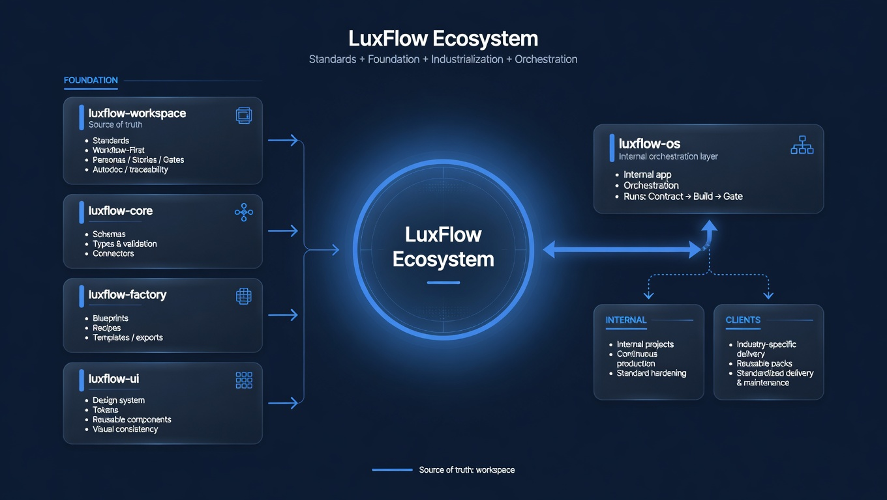
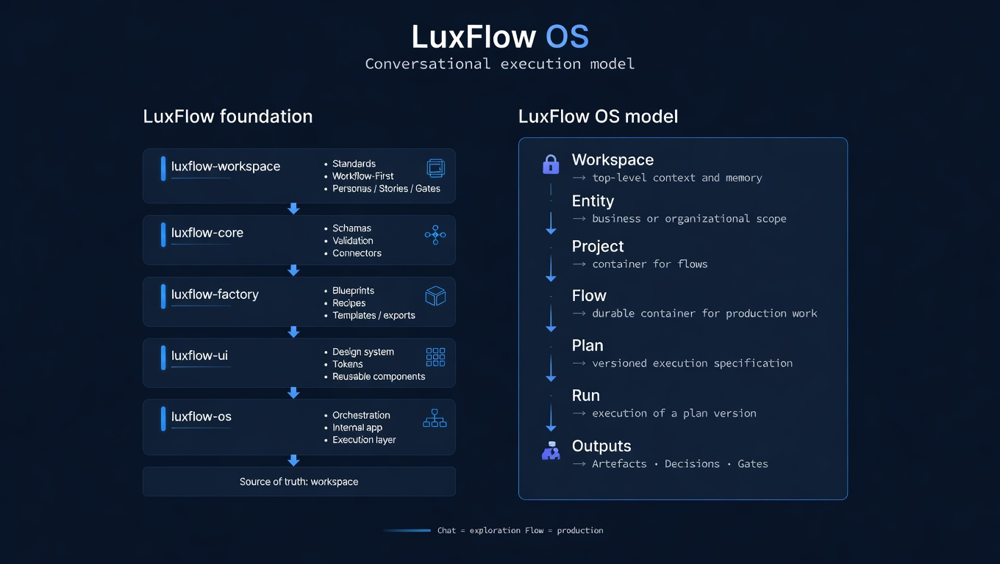

# LuxFlow Showcase

**LuxFlow is a structured ecosystem designed to standardize how digital projects are conceived, produced, delivered, and maintained — with reusable foundations, explicit process, and strong traceability.**

> LuxFlow = standards (`workspace`) + executable foundation (`core`) + industrialization (`factory`) + UI foundation (`ui`) + orchestration (`os`)

---

## Visual overview

### 1. LuxFlow Ecosystem

  

Core ecosystem structure: `workspace` as source of truth, `core` as executable foundation, `factory` as industrialization layer, `ui` as visual foundation, and `os` as orchestration layer.

### 2. LuxFlow OS Model

  

Current execution model: `Workspace → Entity → Project → Flow → Plan → Run → Outputs`, with **Chat** for exploration and **Flow** for production.

---

## Why LuxFlow exists

Digital projects become expensive to maintain when structure, standards, documentation, and reusable foundations are missing or inconsistent.

LuxFlow exists to reduce that friction by separating responsibilities across a clear ecosystem:

- a **source of truth** for standards and process
- an **executable foundation** for schemas, validation, and connectors
- an **industrialization layer** for blueprints, recipes, templates, and exports
- a **UI foundation** for design consistency and reusable components
- an **orchestration layer** for daily execution

The goal is not only to ship projects, but to make them easier to start, easier to scale, and easier to maintain over time.

---

## The ecosystem

### `luxflow-workspace`
**Role:** define how work is structured.

It covers:
- standards
- workflow-first execution
- personas / stories / gates
- conventions and traceability

**Rule:** if a behavior is not defined in `workspace`, it is not standard.

---

### `luxflow-core`
**Role:** define what the system can validate and connect.

It covers:
- schemas and types
- validation
- connectors and integration contracts

**Rule:** `core` does not decide the process; it makes standards executable.

---

### `luxflow-factory`
**Role:** produce reusable production assets.

It covers:
- blueprints
- recipes
- templates
- exports

**Rule:** `factory` consumes `workspace` and `core` to produce reusable, delivery-ready building blocks.

---

### `luxflow-ui`
**Role:** provide the visual and component foundation.

It covers:
- design system logic
- tokens
- reusable components
- visual consistency

**Rule:** `ui` standardizes the presentation layer across LuxFlow projects.

---

### `luxflow-os`
**Role:** orchestrate daily execution.

It covers:
- internal app logic
- orchestration
- execution runs
- `Contract → Build → Gate` flow

**Rule:** `os` is not the source of truth; it applies what the rest of the ecosystem defines.

---

## Workflow-first operating logic

LuxFlow is built around a structured production pattern:

1. **Contract**  
   Define scope, inputs, expected output, and quality gate.

2. **Build**  
   Produce the requested artifacts.

3. **Gate**  
   Validate the result with a PASS / FAIL outcome.

4. **Patch**  
   Apply fixes when a gate fails.

5. **Export**  
   Dispatch the output to its destination.

This creates a more reliable production flow with less rework, less ambiguity, and better traceability.

---

## LuxFlow OS model

The current LuxFlow OS model is structured as follows:

- **Workspace** → top-level context and memory
- **Entity** → business or organizational scope
- **Project** → container for flows
- **Flow** → durable container for production work
- **Plan** → versioned execution specification
- **Run** → execution of a plan version
- **Outputs** → artefacts, decisions, and gates

This model supports a clear distinction between:

- **Chat** = exploration
- **Flow** = production

---

## Internal and client use

### Internal
LuxFlow supports:
- internal R&D
- assets and automations
- process hardening
- continuous production improvement

### Client
LuxFlow supports:
- industry-specific delivery
- reusable implementation packs
- standardized migrations
- delivery and maintenance discipline

The same standards are intended to apply across both internal and client-facing work.

---

## Traceability

Traceability is a foundational part of the LuxFlow approach.

The goal is to keep:
- session visibility
- change visibility
- execution history
- auditability
- delivery clarity

This is especially important for debugging, iteration, operational follow-up, and long-term maintainability.

---

## Public showcase focus

This showcase is centered on the repositories and concepts that best explain the LuxFlow system publicly:

- `luxflow-workspace`
- `luxflow-core`
- `luxflow-factory`
- `luxflow-ui`
- `luxflow-os`

These foundations support related production work such as:

- **ZAZO Beats** — production website project in final closure phase
- **ArtCeption** — next structured production build

---

## Separate but related ecosystem work

**AVNIR-Studio** is a separate ecosystem and is not directly coupled to LuxFlow.

It remains related in terms of product thinking, workflow structuring, and system design experience, but it should not be presented as part of the LuxFlow repository architecture itself.

---

## Current state

### Established
- multi-repository structure
- workflow-first logic
- `workspace` as source of truth
- reusable foundation split across dedicated repositories
- strong emphasis on process, structure, and maintainability

### In active development
- deeper orchestration
- more executable contracts and validators
- more reusable packs / blueprints
- broader productization of the ecosystem

---

## What makes LuxFlow different

- standards first
- reusable foundations
- execution discipline
- traceability by design
- ecosystem thinking instead of one-off project setup

LuxFlow is designed to reduce chaos, reduce rework, and improve delivery quality over time.

---

## Recommended related reading

- `workspace/docs/CONTEXT.md`
- `workspace/docs/WORKFLOW_FIRST.md`
- `workspace/docs/PERSONAS.md`
- `workspace/specs/*`
- `factory/blueprints/*`
- `os/*`
