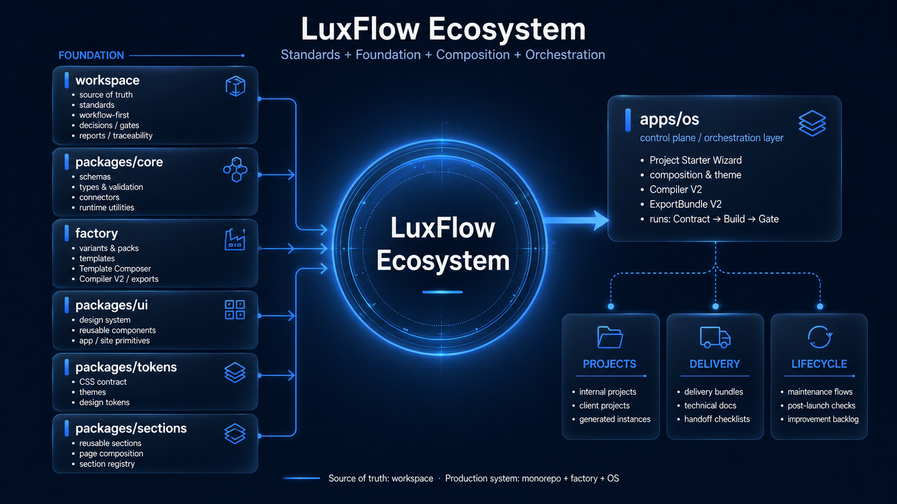

# LuxFlow Showcase

LuxFlow is a workflow-first project production system designed to help build, document, validate, deliver and maintain digital projects with more structure, reliability and speed.

This repository is a public showcase of the LuxFlow ecosystem. It does not expose the full private monorepo. Its purpose is to present the vision, architecture, methodology, technical patterns and product direction behind LuxFlow.

---

## What is LuxFlow?

LuxFlow is built around a simple idea:

> Turn project creation from an improvised process into a structured production pipeline.

Instead of starting every website, product, client project or internal tool from scratch, LuxFlow defines reusable foundations:

- project workflows;
- template and section composition;
- design-system tokens;
- reusable UI components;
- validation gates;
- export bundles;
- documentation standards;
- lifecycle and maintenance flows.

The goal is not to replace development with AI.  
The goal is to make project production more predictable, reusable and easier to maintain.

---

## Core Philosophy

LuxFlow follows a **Workflow-First** approach:

```txt
Contract → Build → Gate → Patch → Export → Maintain
```

Each project should have:

- a clear contract before execution;
- concrete artefacts after production;
- validation gates before delivery;
- traceable decisions;
- reusable outputs;
- maintenance logic after launch.

This makes LuxFlow closer to a **project operating system** than a simple prompt collection or template library.

---

## Why LuxFlow Exists

Most small teams, solo developers and agencies lose time because project production is fragmented:

- briefs are unclear;
- templates are duplicated;
- design systems are inconsistent;
- project setup is repetitive;
- validation is manual;
- delivery documentation is forgotten;
- maintenance starts too late;
- AI outputs are difficult to control.

LuxFlow tries to solve this by combining:

- structured project configuration;
- reusable templates and sections;
- design-system standards;
- automated validation;
- exportable artefacts;
- lifecycle documentation;
- controlled AI-assisted production.

---

## Ecosystem Overview

LuxFlow is organized around several layers.

```txt
LuxFlow
├─ OS / Console
│  └─ Project starter, composer, exports, previews
├─ Factory
│  └─ Templates, variants, packs, project configuration
├─ UI
│  └─ Reusable component library
├─ Tokens
│  └─ Design tokens, themes, CSS contracts
├─ Sections
│  └─ Reusable page sections
├─ Workflow System
│  └─ Contract, build, gates, patches, reports
├─ Lifecycle Layer
│  └─ Delivery, maintenance, post-launch flows
└─ Showcase / Documentation
   └─ Public explanation of the system
```

---

## Visual Overview

### LuxFlow Ecosystem Map



---

## Main Concepts

### 1. LuxFlow OS

LuxFlow OS is the future control interface of the ecosystem.

It is designed as a project console where a user can:

- create a project;
- select a project type;
- choose a template variant;
- compose sections;
- configure a theme;
- generate a project configuration;
- export production-ready instructions and artefacts.

The interface is meant to feel conversational, but it is not a basic AI chatbot.

AI should only intervene when it helps produce, transform, review or validate something.  
The rest of the experience should be guided through structured interactions: cards, toggles, choices, chips, previews and gates.

---

### 2. Factory

The Factory layer contains the logic used to prepare projects.

It can include:

- site types;
- template variants;
- reusable packs;
- section composition;
- content modes;
- integration requirements;
- project configuration schemas;
- prompt compiler logic;
- export bundle generation.

Example of a simplified project configuration:

```ts
const projectConfig = {
  project: {
    name: "Client Landing Page",
    slug: "client-landing-page",
  },
  template: {
    variant: "next-landing-campaign",
    site_type: "vitrine",
  },
  composition_v1: {
    sections: [
      { id: "hero", enabled: true },
      { id: "features", enabled: true },
      { id: "testimonials", enabled: true },
      { id: "faq", enabled: true },
      { id: "contact-cta", enabled: true },
    ],
  },
};
```

---

### 3. UI Library

LuxFlow includes a reusable UI library for shared interface components.

The objective is to avoid rebuilding the same components across projects:

- buttons;
- cards;
- navbars;
- footers;
- forms;
- layouts;
- content blocks;
- commerce blocks;
- app shell components.

The UI layer is designed to be consumed by projects instead of copied manually.

Example:

```tsx
import { FormButton, PrimitivesCard } from "@luxflow/ui";

export function ExampleCard() {
  return (
    <PrimitivesCard>
      <h2>Reusable UI</h2>
      <p>This component should stay consistent across LuxFlow projects.</p>
      <FormButton>Continue</FormButton>
    </PrimitivesCard>
  );
}
```

---

### 4. Tokens and Themes

LuxFlow uses design tokens to keep visual systems consistent.

A project theme should override variables instead of rewriting the full design system.

Simplified example:

```css
:root {
  --lf-bg: #ffffff;
  --lf-surface: #f8f8f8;
  --lf-text: #111111;
  --lf-muted: #666666;

  --lf-brand: #7c3aed;
  --lf-brand-contrast: #ffffff;

  --lf-radius-sm: 0.375rem;
  --lf-radius-md: 0.75rem;
  --lf-radius-lg: 1rem;
}
```

This approach makes it easier to:

- switch brand themes;
- reuse components;
- keep visual consistency;
- avoid hardcoded styles;
- maintain multiple projects over time.

---

### 5. Sections

LuxFlow also includes reusable page sections.

A section is larger than a UI component.  
It represents a complete page block such as:

- hero;
- feature grid;
- FAQ;
- testimonials;
- contact CTA;
- process section;
- local business information;
- pricing section.

Simplified section registry example:

```ts
export const sectionRegistry = {
  hero: {
    component: "HeroSection",
    package: "@luxflow/sections",
    required: true,
  },
  faq: {
    component: "FaqSection",
    package: "@luxflow/sections",
    required: false,
  },
  contactCta: {
    component: "ContactCtaSection",
    package: "@luxflow/sections",
    required: false,
  },
};
```

The goal is to move from fixed templates to a real **Template Composer**.

---

## Template Composer Direction

The long-term objective is not to maintain dozens of rigid templates.

LuxFlow is moving toward a composer logic:

```txt
Site Type
→ Base Variant
→ Sections
→ Packs
→ Integrations
→ Theme
→ Content Mode
→ Project Config
→ Compiled Output
```

This makes it possible to generate projects that are more flexible than classic templates while still keeping strong structure.

Example:

```txt
User choice:
- Site type: Service business
- Goal: Generate leads
- Style: Premium and minimal
- Sections: Hero, Services, Proof, FAQ, Contact
- Integrations: Contact form, Map
- Theme: Brand dark/light

LuxFlow output:
- Project configuration
- Suggested file structure
- Prompt bundle
- Required components
- Required gates
- Delivery checklist
```

---

## Reliability System

LuxFlow is designed around gates.

A gate is a validation checkpoint that prevents uncontrolled delivery.

Examples:

```txt
GATE-001 — Required files exist
GATE-002 — TypeScript passes
GATE-003 — Build passes
GATE-004 — No forbidden CSS imports
GATE-005 — No hardcoded secrets
GATE-006 — Required documentation exists
GATE-007 — Export bundle is valid
```

Simplified validation example:

```js
import { existsSync } from "node:fs";

const requiredFiles = [
  "README.md",
  "docs/ARCHITECTURE.md",
  "docs/WORKFLOW_FIRST.md",
];

for (const file of requiredFiles) {
  if (!existsSync(file)) {
    throw new Error(`Missing required file: ${file}`);
  }
}

console.log("Showcase validation passed.");
```

---

## Export Bundle Concept

LuxFlow should be able to export a structured bundle for each generated project.

A simplified export bundle can look like this:

```ts
export const exportBundle = {
  project_config: {
    name: "Client Landing Page",
    variant: "next-landing-campaign",
  },
  generated_prompt: "...",
  expected_artifacts: [
    "README.md",
    "theme.css",
    "app/page.tsx",
    "docs/DELIVERY.md",
  ],
  gates: [
    "build",
    "typecheck",
    "token-usage",
    "template-composer",
  ],
};
```

The purpose is to make project generation traceable and repeatable.

---

## Lifecycle Layer

LuxFlow does not stop at project generation.

A complete project should also include:

- client handoff;
- technical documentation;
- SEO checklist;
- deployment checklist;
- post-launch checklist;
- maintenance plan;
- improvement backlog.

This is important because delivery is not the end of a project.  
Maintenance, iteration and quality control should be part of the system from the start.

---

## Example Use Cases

LuxFlow can support different types of projects:

```txt
Service websites
Landing pages
Portfolio websites
CMS / blog websites
Knowledge libraries
E-commerce websites
SaaS interfaces
Internal tools
Client portals
Training platforms
Documentation systems
```

The same foundation can be reused while adapting:

- sections;
- content;
- integrations;
- themes;
- gates;
- delivery requirements.

---

## What This Repository Is

This repository is a public presentation layer for LuxFlow.

It is meant to show:

- the product vision;
- the architecture;
- the production methodology;
- the technical direction;
- the design-system logic;
- the workflow-first approach;
- examples of configuration and validation patterns.

---

## What This Repository Is Not

This repository is not the full LuxFlow private monorepo.

It does not include:

- the complete source code;
- private client projects;
- private credentials;
- internal business files;
- unpublished production logic;
- sensitive project data.

The goal is to provide a clear and professional overview without exposing private implementation details.

---

## Technical Skills Demonstrated

LuxFlow demonstrates work across several areas:

```txt
Product architecture
Design systems
Frontend engineering
Next.js architecture
Reusable component systems
Workflow automation
Validation scripts
Documentation systems
Project scaffolding
Prompt engineering
AI-assisted production workflows
Developer tooling
Technical writing
Repository organization
```

---

## Tech Stack

The LuxFlow ecosystem is designed around modern web and tooling standards.

```txt
TypeScript
React
Next.js
Node.js
pnpm
CSS variables
Design tokens
Reusable packages
Validation scripts
GitHub workflows
Structured JSON configuration
```

Additional integrations may be used depending on the project:

```txt
Supabase
Stripe
Vercel
Resend
GitHub
AI APIs
```

---

## Current Status

LuxFlow is an active private ecosystem.

The current direction is focused on:

- stabilizing the public showcase;
- documenting the system clearly;
- improving the Template Composer;
- making LuxFlow OS easier to use;
- validating the system on real projects;
- reducing duplication across templates;
- improving delivery and maintenance flows.

---

## Roadmap

### Short Term

```txt
Improve public showcase documentation
Add technical examples
Add architecture diagrams
Add case studies
Add clearer recruiter/client-facing summaries
```

### Mid Term

```txt
Improve Template Composer
Strengthen section-based project generation
Add better theme configuration
Improve project export bundles
Validate more real project scenarios
```

### Long Term

```txt
Turn LuxFlow OS into a usable production console
Support more project families
Improve lifecycle automation
Create a reliable system for internal and client projects
Expose selected parts as public packages or products
```

---

## Repository Structure

Recommended structure for this showcase repository:

```txt

```

---

## Author

Created by **Maxime Zaoui**.

LuxFlow is part of a broader effort to build a structured production system for digital projects, internal tools, client work and creative business ecosystems.
